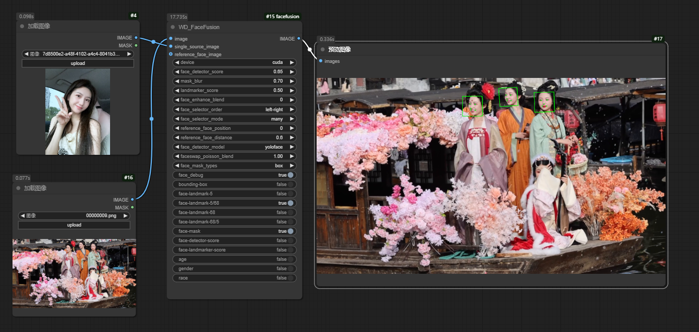

# FaceFuison extension for ComfyUI

[FaceFusion](https://github.com/facefusion/facefusion) is a very nice face swapper and enhancer.

# install
将项目复制到'~/ComfyUI/custom_nodes'下，进入目录执行`pip install -r requirments.txt`

# download models
模型会在执行时自动下载，如有需要可以提前下载到项目文件夹下的`.assets/models/`路径下 【可以找代理网站加速，如https://gitproxy.click/】   
```
https://github.com/facefusion/facefusion-assets/releases/download/models-3.0.0/2dfan4.onnx
https://github.com/facefusion/facefusion-assets/releases/download/models-3.0.0/arcface_w600k_r50.onnx
https://github.com/facefusion/facefusion-assets/releases/download/models-3.0.0/dfl_xseg.onnx
https://github.com/facefusion/facefusion-assets/releases/download/models-3.0.0/fairface.onnx
https://github.com/facefusion/facefusion-assets/releases/download/models-3.0.0/fan_68_5.onnx
https://github.com/facefusion/facefusion-assets/releases/download/models-3.0.0/gfpgan_1.4.onnx
https://github.com/facefusion/facefusion-assets/releases/download/models-3.0.0/inswapper_128.onnx
https://github.com/facefusion/facefusion-assets/releases/download/models-3.0.0/kim_vocal_2.onnx
https://github.com/facefusion/facefusion-assets/releases/download/models-3.0.0/open_nsfw.onnx
https://github.com/facefusion/facefusion-assets/releases/download/models-3.0.0/bisenet_resnet_34.onnx
https://github.com/facefusion/facefusion-assets/releases/download/models-3.0.0/yoloface_8n.onnx
https://github.com/facefusion/facefusion-assets/releases/download/models-3.0.0/retinaface_10g.onnx
https://github.com/facefusion/facefusion-assets/releases/download/models-3.0.0/scrfd_2.5g.onnx
https://github.com/facefusion/facefusion-assets/releases/download/models-3.1.0/arcface_converter_hififace.onnx
https://github.com/facefusion/facefusion-assets/releases/download/models-3.1.0/bisenet_resnet_18.onnx
https://github.com/facefusion/facefusion-assets/releases/download/models-3.1.0/hififace_unofficial_256.onnx
https://github.com/facefusion/facefusion-assets/releases/download/models-3.1.0/realistic_rescaler_x4.onnx
https://github.com/facefusion/facefusion-assets/releases/download/models-3.1.0/real_web_photo_x4.onnx
https://github.com/facefusion/facefusion-assets/releases/download/models-3.1.0/remacri_x4.onnx
https://github.com/facefusion/facefusion-assets/releases/download/models-3.1.0/siax_x4.onnx
https://github.com/facefusion/facefusion-assets/releases/download/models-3.1.0/styleganex_age.onnx
https://github.com/facefusion/facefusion-assets/releases/download/models-3.1.0/swin2_sr_x4.onnx
https://github.com/facefusion/facefusion-assets/releases/download/models-3.1.0/xseg_1.onnx
https://github.com/facefusion/facefusion-assets/releases/download/models-3.1.0/xseg_2.onnx
https://github.com/facefusion/facefusion-assets/releases/download/models-3.0.0/bisenet_resnet_34.onnx


https://github.com/facefusion/facefusion-assets/releases/download/models-3.0.0/2dfan4.hash
https://github.com/facefusion/facefusion-assets/releases/download/models-3.0.0/arcface_w600k_r50.hash
https://github.com/facefusion/facefusion-assets/releases/download/models-3.0.0/dfl_xseg.hash
https://github.com/facefusion/facefusion-assets/releases/download/models-3.0.0/fairface.hash
https://github.com/facefusion/facefusion-assets/releases/download/models-3.0.0/fan_68_5.hash
https://github.com/facefusion/facefusion-assets/releases/download/models-3.0.0/gfpgan_1.4.hash
https://github.com/facefusion/facefusion-assets/releases/download/models-3.0.0/inswapper_128.hash
https://github.com/facefusion/facefusion-assets/releases/download/models-3.0.0/kim_vocal_2.hash
https://github.com/facefusion/facefusion-assets/releases/download/models-3.0.0/open_nsfw.hash
https://github.com/facefusion/facefusion-assets/releases/download/models-3.0.0/bisenet_resnet_34.hash
https://github.com/facefusion/facefusion-assets/releases/download/models-3.0.0/yoloface_8n.hash
https://github.com/facefusion/facefusion-assets/releases/download/models-3.0.0/retinaface_10g.hash
https://github.com/facefusion/facefusion-assets/releases/download/models-3.0.0/scrfd_2.5g.hash
https://github.com/facefusion/facefusion-assets/releases/download/models-3.1.0/arcface_converter_hififace.hash
https://github.com/facefusion/facefusion-assets/releases/download/models-3.1.0/bisenet_resnet_18.hash
https://github.com/facefusion/facefusion-assets/releases/download/models-3.1.0/hififace_unofficial_256.hash
https://github.com/facefusion/facefusion-assets/releases/download/models-3.1.0/realistic_rescaler_x4.hash
https://github.com/facefusion/facefusion-assets/releases/download/models-3.1.0/real_web_photo_x4.hash
https://github.com/facefusion/facefusion-assets/releases/download/models-3.1.0/remacri_x4.hash
https://github.com/facefusion/facefusion-assets/releases/download/models-3.1.0/siax_x4.hash
https://github.com/facefusion/facefusion-assets/releases/download/models-3.1.0/styleganex_age.hash
https://github.com/facefusion/facefusion-assets/releases/download/models-3.1.0/swin2_sr_x4.hash
https://github.com/facefusion/facefusion-assets/releases/download/models-3.1.0/xseg_1.hash
https://github.com/facefusion/facefusion-assets/releases/download/models-3.1.0/xseg_2.hash
https://github.com/facefusion/facefusion-assets/releases/download/models-3.0.0/bisenet_resnet_34.hash
```

# play

single_source_image: 换脸来源   
video和video_url：都是加载视频，一个是本地上传，一个是url加载    
reference_face_image：脸部追踪，当启用face_selector_mode=reference时，在多人视频中跟踪相似的脸进行替换   
face_enhance_blend:gfpgan1.4修正脸部的强度，0~100 ，0就是不启用修正   
thread_count: 视频帧换脸时的并发线程数   


single_source_image: 换脸来源   
image：换脸目标   
reference_face_image：脸部追踪，当启用face_selector_mode=reference时，在多人图片中跟踪相似的脸进行替换   
face_enhance_blend:gfpgan1.4修正脸部的强度，0~100 ，0就是不启用修正  

## fix
1: yoloface 有时识别不出来明显的人脸，导致闪帧，放出选项用retinaface或者scrfd，需要补充下载两个模型

2: 添加debug选项方便排查

3: 替换facefusion内容为https://github.com/facefusion/facefusion的原版，日后只要注意fixme内容即可直接替换。并且添加了3.1.0的模型，记得下载，放置位置和原来相同。
4: 下面这张照片经过编码得到的数据在inswapper_128_fp16的模型计算下会越界，所以切换成32位模型。  
下载https://github.com/facefusion/facefusion-assets/releases/download/models-3.0.0/inswapper_128.onnx和https://github.com/facefusion/facefusion-assets/releases/download/models-3.0.0/inswapper_128.hash添加到原来的位置

